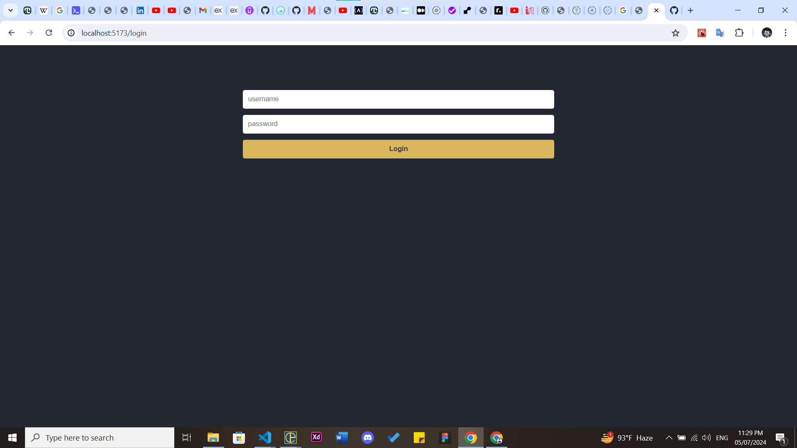
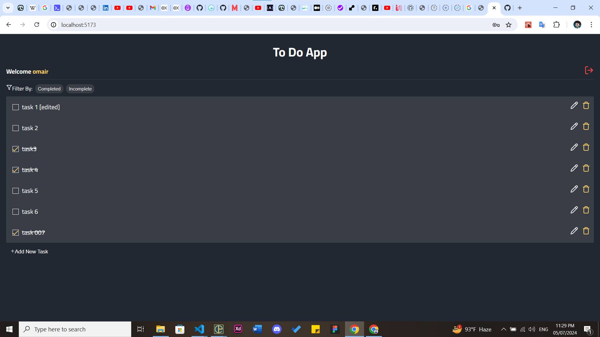

# Simple To-Do App

This project is a simple task management application built using ReactJS. It allows users to manage their tasks directly in the browser. Since there is no backend implemented, tasks and user sessions are stored locally using localStorage.

## Features

- Add new tasks
- Mark tasks as completed
- Edit and Delete tasks
- Persist tasks in localStorage
- Basic user session management

## Technologies Used

-ReactJS: Frontend JavaScript library for building user interfaces

- localStorage: Browser-based storage for persisting tasks and user sessions

## Installation

To run this project locally, follow these steps:

1. Clone the repository:

2. Install dependencies:
   `npm install`
3. Start the development server:
   `npm run start`

## App images

